import Details from '@site/src/components/Details';
import styles from '@site/src/pages/d2docs.module.css';

# Prologue

To begin this raid, all gaurdians need to walk forward into the palace in front of the spawn. once here, there is some dialogue from riven, and an obvious trap door on the left wall opens. There is a pretty straightforward path to the first encounter, it's a pretty hard to miss door that unlocks when approached.

## The Wall of Wishes

To get to the Wall of Wishes, continue to the room before the first encounter. Make a left and jump across a bit of water onto a rock, from there follow a series of grassy platforms with glowing plants; these lead to the wall. to input a wish, shoot the panels until they are on the correct symbol. Once you're done, stand on the plate.

### Wishes

  
Warp To: Shuro Chi, the Corrupted

  
  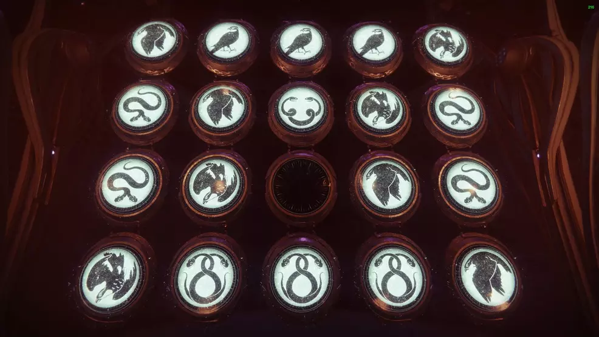

  
Warp To: Morgeth, the Spirekeeper

  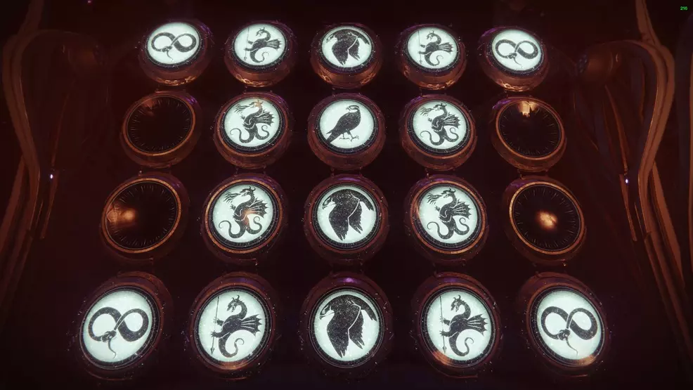

  
Warp To: Vault

  
  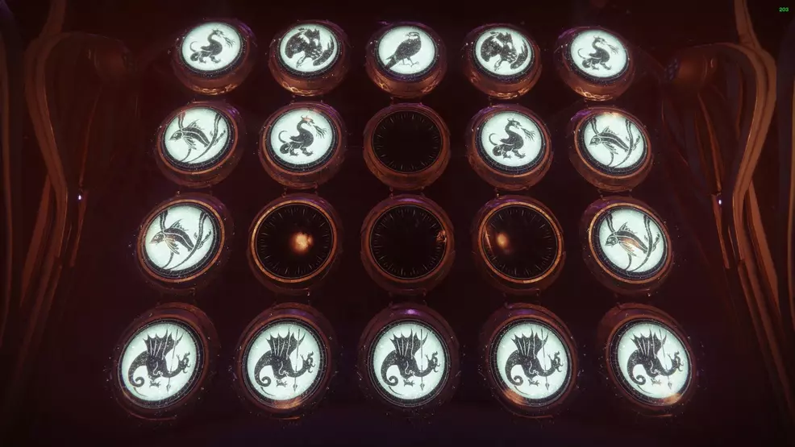

  
Warp To: Riven, of a Thousand Voices

  
  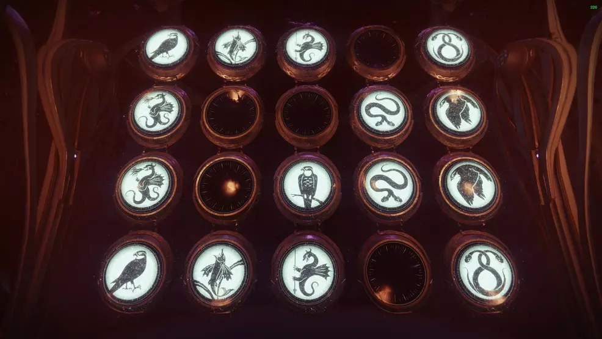

  
Emblem: Numbers of Power

  
  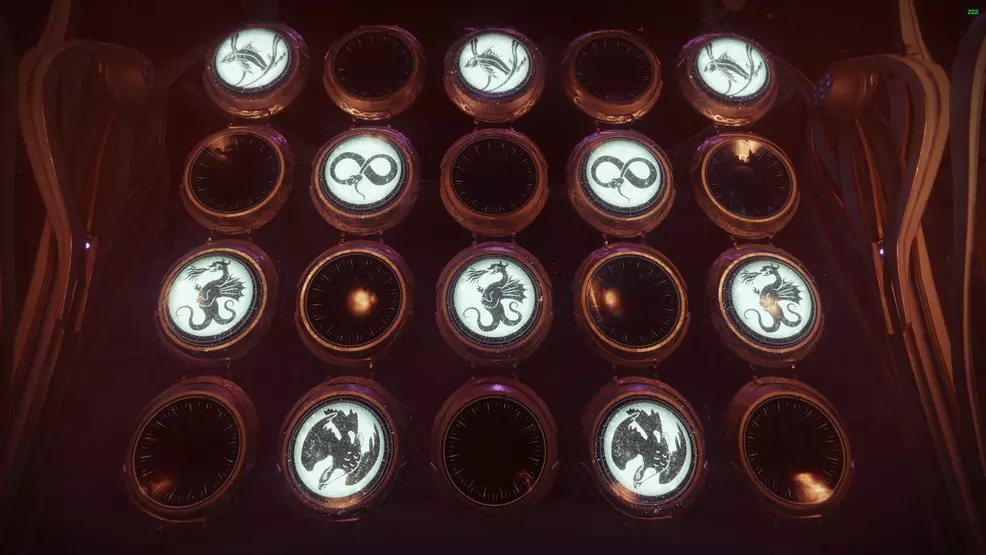

  
Modifier: Corrupted eggs

  
  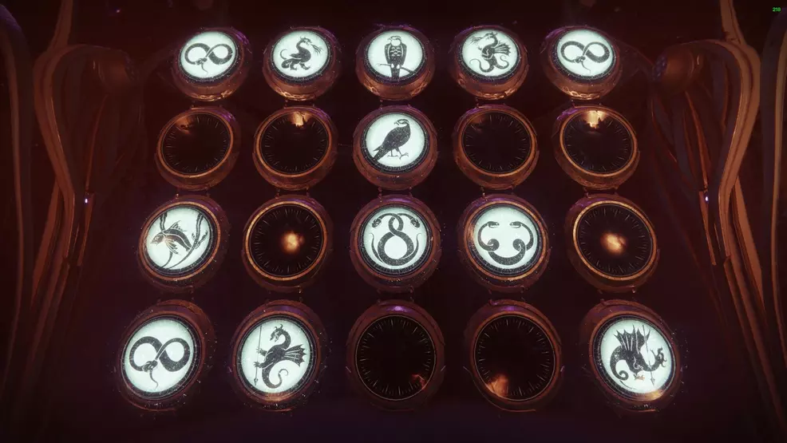

  
Modifier: Petra's Run

  
  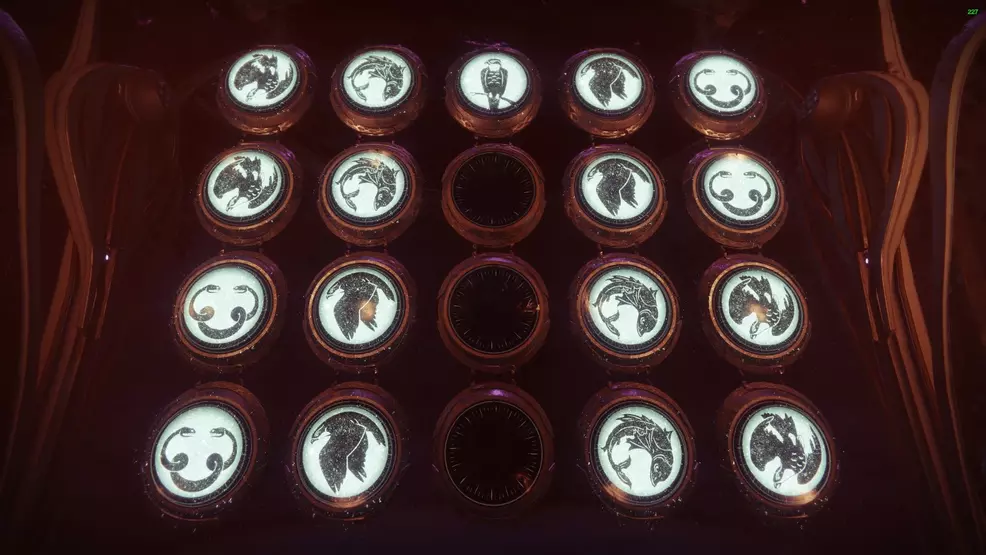

  
Item: Extra Ethereal Key

  
  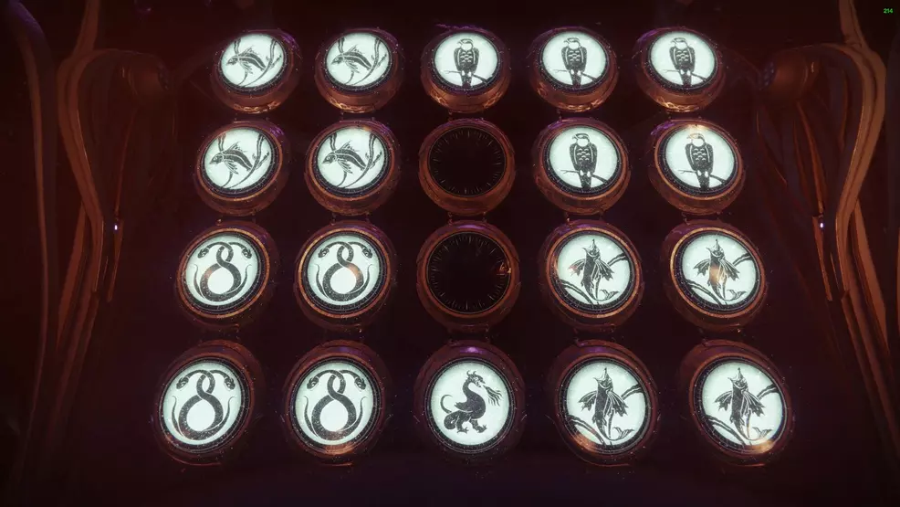

  
Modifier: Glittering Chest

  Spawns the [glittering chest](lw-e3#dps) between morgeth and the vault
  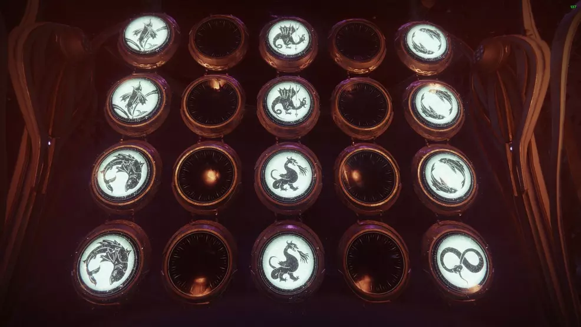

  
Voice: Failsafe

  
  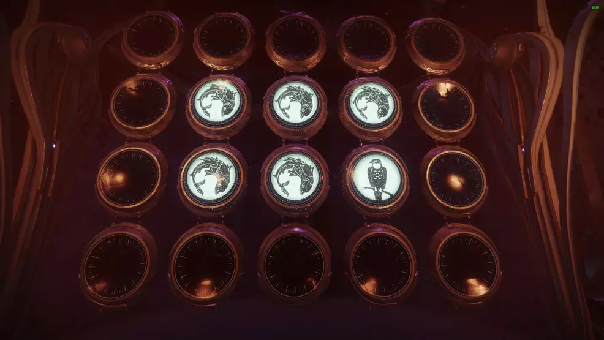

  
Voice: Drifter

  
  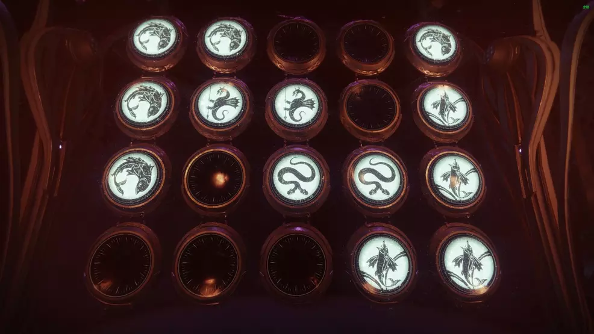

  
Modifier: Hats

  
  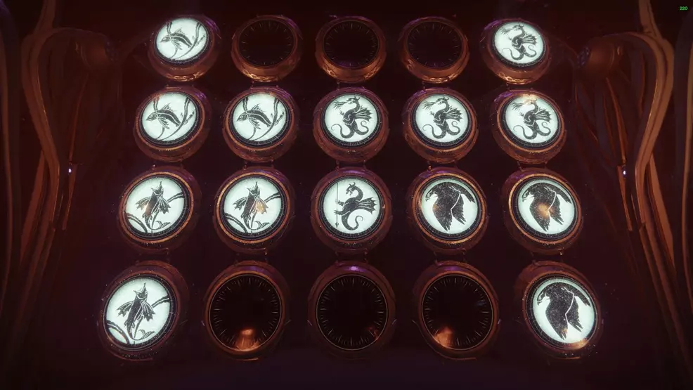

  
Modifier: Headshot Confetti (Grunt Birthday)

  
  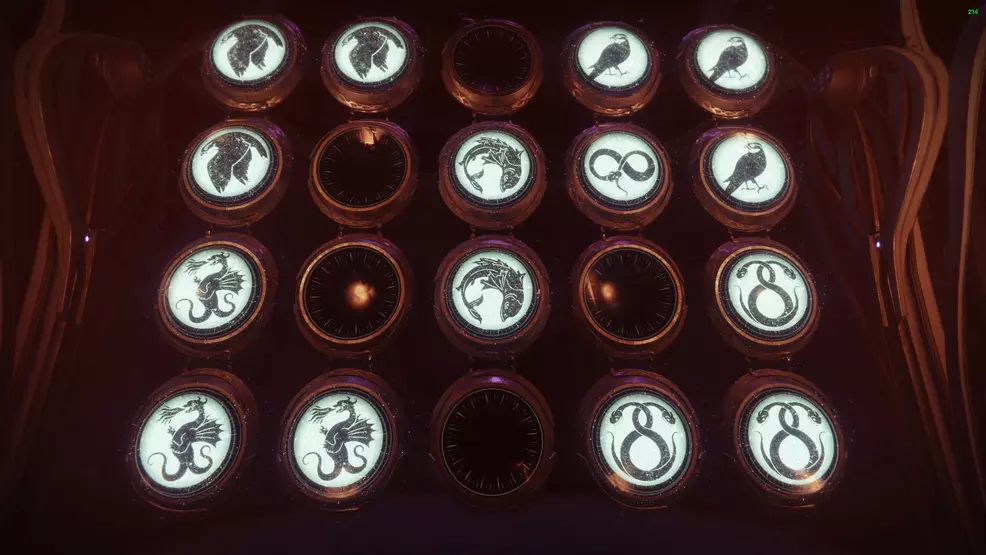

### The 15th wish

*One you will cherish forever* ~ Riven, of a Thousand Voices