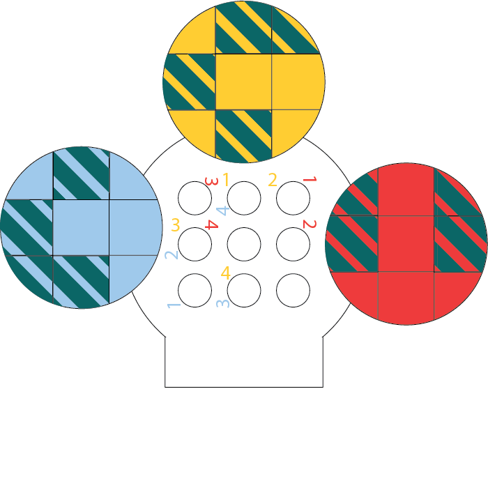

# shuro chi, the corrupted

## the eye of riven

there are a ton of red bars that spawn in waves throught this encounter, your goal is to push through to the boss. there is one elite enemy that spawns named Eye of Riven. once killed, this enemy drops a taken essence; this mechanic is rarely ever used as it's not at all necessary. if picked up, this essence gives stacks of a debuff called *Taken Essence Antumbra* while held. if a gaurdian reaches 10 stacks, they will die.

the taken essence holder can shoot with it; when shuro chi is readying her weapon (a white beam will start glowing over her head, similar to kalli), using the super will fire a shot that stuns her for a moderate duration.

:::tip if you run out of heavy ammo
it's a good idea to pick up the taken essence if the fireteam is low on ammo, or there's any doubt there isn't enough dps to get shuro chi down to the next health gate
:::

## dps

shuro chi is a burst dps boss, her health bar is split into sixths. the building is split into three floors, with two dps phases on each floor. as the fireteam pushes against the waves of adds eventually they will reach a point where shuro chi stops near three plates.

once the second wave of adds that spawn around shuro chi are killed, three crystals will spawn on the platforms around her. three gaurdians need to pick up the crystals, then once all three are ready jump on the platforms in unison, and create a loop around shuro chi by shooting eachother with the laser that fires from the crystal. to keep things simple, most fireteams just shoot at the crystal holder to their right. these plates damage any gaurdians standing on them, so crystal holders should be sure to not only wait until all of the other holders are ready to jump on; but also be quick to create a triangle so the three gaurdians on the plates can jump back off.

after a sixth of shuro chi's health is depleated, she will become immune and teleport away. after you complete two dps phases on one floor, you will have to climb to the next one.

## plates

just like the plates right before dps, these plates damage any gaurdians standing on them. however, **each person can also only step on each plate once per floor**. this means they need to keep a mental note of which plates they've stepped on. there will be big symbols on three of the walls. the first active symbol will be on the left, and they rotate clockwise around the room.

the active symbol will always have 4 sections missing. as such, the fireteam should appoint 4 gaurdians to step on the plates, and assign numbers to each of them (1-4) these 4 guardians must orient themselves with the active symbol, and step on the plates coresponding with their number & the missing sections of the symbol on the wall.

if a gaurdian happens to not be able to step onto a plate, they have to switch plates with someone else team or have one of the two gaurdians add clearing hop onto it.

if this still sounds confusing, consider the example below.

after the fireteam clears each wall, a platform will come down to aid in jumping to the next floor.

:::tip secret chest #2
at the big tree, find an exit to the left. jump on ledges of the cliff face and the chest will be easily spotted on the edge of the cliff
:::