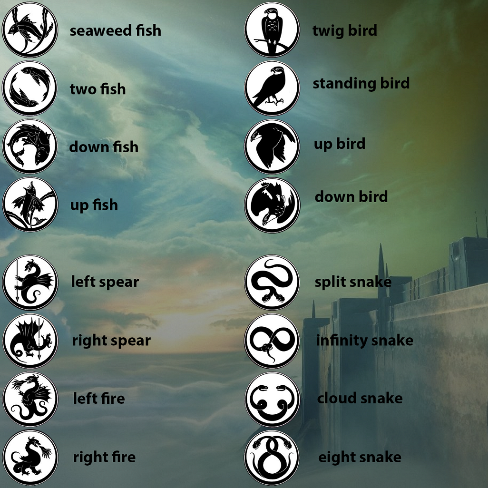

# the vault

## roles

there are three rooms: steps, rocks, and tree. there are also plates outside each room, these are referred to as the room's plate. (ex. tree plate)

the fireteam should split up into two teams of three.

- add clears (3)

    - one to each room
    - do not kill the eye of riven taken captian until a reader is in the room (as it will lock them out)
    - kill the taken knights that spawn in the back of the room, if a knight gets through the barrier let your team know (knight steps, etc.)

- readers (3)

    - one to each plate
    - communicate with other readers during reading
    - hunt your eye of riven when it spawns and bring it's taken essence to the correct plate

## how the vault works

if at any point a taken knight reaches a plate, and keeps their sword in it long enough, they will overload the vault security, and the fireteam will wipe.

the encounter begins when the readers all step onto their plates. each reader should face the middle of the room, as a screen will light up with a random three of the symbols below:

- one reader starts by saying what they see in the middle
- a second reader will say that they see that symbol on their left or right
- then the same reader will say what they see in the middle

because there is always at least one left and one right, repeat this until either:

- the readers learn that 2 plates are the same (for example: 2 left, means 1 right)
- the readers learn every plate's attunement (left or right)

if a reader sees another's called out middle symbol on their left, that means their plate is **penumbra**; if they see it on the right, their plate is **antumbra**; more on these later

:::tip taken essence
**left** is **P** | **right** is **A**
:::

while the readers have been doing this, two of the rooms will have been closed off. the reader near the one that is still open needs to go inside and kill the eye of riven. once this eye of riven is killed it will drop a taken esscence and lock them inside. the reader must pick up the taken essence and look at the debuff it gives them.

the reader will either have a debuff called antumbra or penumbra. as mentioned above, this determines which plate you need to take this essence to. the other two readers will be able to assist the one running in coordinating which plates are available/matching the debuff. this essence works the same as the ones in the previous encounters, activate grenade to use it.

when this entire process is completed three times, the vault will open.